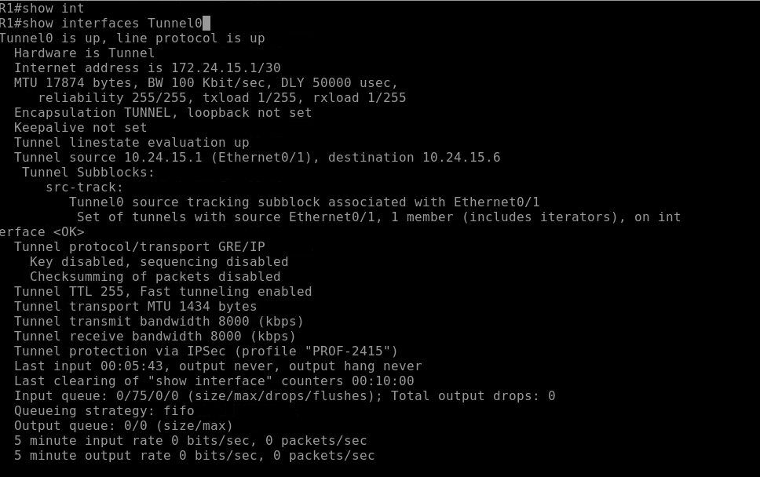
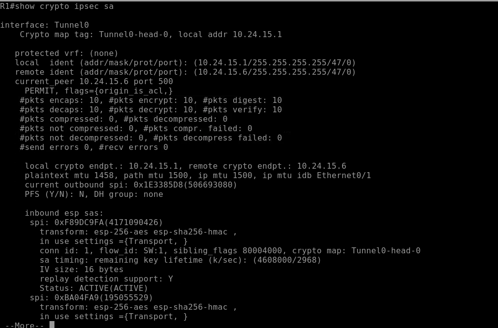
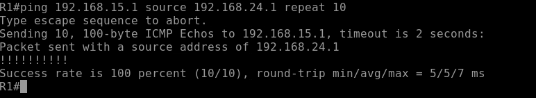

# VPN Site-to-Site IPSec IKEv1 GRE Tunnel

**Estudiante:** Edwin De Paula  
**Matricula:** 2024-2415  
**Institución:** Instituto Tecnológico de las Américas (ITLA)  
**Asignatura:** Seguridad en Redes

---

## Video

| Recurso | URL |
|---|---|
| Video YouTube | https://youtu.be/rNby8jksG5c |

---

## Objetivo

Implementar una VPN Site-to-Site utilizando un túnel GRE explícito cifrado con IPSec IKEv1 entre dos sitios remotos a través de un router ISP. A diferencia de los labs anteriores, en este lab el túnel GRE se crea explícitamente con `tunnel mode gre ip` e IPSec lo cifra por encima en modo Transport, aprovechando que GRE ya agrega su propio header de encapsulación.

---

## Topología


| Dispositivo | Interfaz | Dirección IP | Descripción |
|---|---|---|---|
| R1 | Ethernet0/0 | 192.168.24.1/24 | LAN Site A |
| R1 | Ethernet0/1 | 10.24.15.1/30 | WAN hacia ISP |
| R1 | Tunnel0 | 172.24.15.1/30 | Túnel GRE virtual |
| ISP | Ethernet0/0 | 10.24.15.2/30 | WAN hacia R1 |
| ISP | Ethernet0/1 | 10.24.15.5/30 | WAN hacia R2 |
| R2 | Ethernet0/0 | 10.24.15.6/30 | WAN hacia ISP |
| R2 | Ethernet0/1 | 192.168.15.1/24 | LAN Site B |
| R2 | Tunnel0 | 172.24.15.2/30 | Túnel GRE virtual |
| PC-A | eth0 | 192.168.24.10/24 | Gateway: 192.168.24.1 |
| PC-B | eth0 | 192.168.15.10/24 | Gateway: 192.168.15.1 |

---

## Parámetros de Configuración

### Fase 1 - IKEv1 (ISAKMP)

| Parámetro | Valor |
|---|---|
| Política | 10 |
| Cifrado | AES 256 |
| Hash | SHA-256 |
| Autenticación | Pre-shared Key |
| Grupo Diffie-Hellman | Grupo 14 (2048 bits) |
| Lifetime | 86400 segundos (24 horas) |
| Pre-shared Key | Edwin2024 |

### Fase 2 - IPSec (Transform Set)

| Parámetro | Valor |
|---|---|
| Nombre | TS-2415 |
| Protocolo | ESP |
| Cifrado | AES 256 |
| Integridad | SHA-256 HMAC |
| Modo | **Transport** (no Tunnel) |

### GRE Tunnel e IPSec Profile

| Parámetro | Valor |
|---|---|
| Perfil IPSec | PROF-2415 |
| Modo del túnel | GRE/IP explícito |
| Interfaz Tunnel R1 | Tunnel0 — 172.24.15.1/30 |
| Interfaz Tunnel R2 | Tunnel0 — 172.24.15.2/30 |
| Tunnel Source R1 | Ethernet0/1 (10.24.15.1) |
| Tunnel Source R2 | Ethernet0/0 (10.24.15.6) |
| Tunnel Destination R1 | 10.24.15.6 |
| Tunnel Destination R2 | 10.24.15.1 |

---

## Explicación de la Configuración

### ¿Qué es GRE over IPSec?

GRE (Generic Routing Encapsulation) es un protocolo de tunelización que encapsula paquetes de cualquier protocolo dentro de paquetes IP. En este lab, GRE crea el túnel virtual y IPSec lo cifra por encima.

### ¿Por qué modo Transport en lugar de Tunnel?

En los labs anteriores IPSec usaba modo Tunnel porque necesitaba encapsular el paquete IP completo. En este lab, GRE ya se encarga de la encapsulación — agrega su propio header. Por eso IPSec solo necesita cifrar el payload GRE, sin agregar un header adicional. Esto se llama modo Transport y es más eficiente en términos de overhead.

### Diferencia entre los tres labs IKEv1

| Aspecto | Policy-Based | Route-Based | GRE Tunnel |
|---|---|---|---|
| Define tráfico | ACL | Tabla de ruteo | Tabla de ruteo |
| Interfaz virtual | No | Tunnel0 implícito | Tunnel0 GRE explícito |
| Modo IPSec | Tunnel | Tunnel | **Transport** |
| `tunnel mode` | N/A | GRE/IP (default) | `gre ip` explícito |

### Flujo de Negociación

1. PC-A genera tráfico hacia 192.168.15.0/24
2. R1 consulta la tabla de ruteo — apunta a Tunnel0 via 172.24.15.2
3. El tráfico es encapsulado por GRE dentro de Tunnel0
4. IPSec cifra el paquete GRE en modo Transport
5. R1 negocia IKEv1 Fase 1 y Fase 2 con R2
6. El tráfico GRE cifrado viaja a través del ISP hasta R2

---

## Verificación

### Interfaz Tunnel0

```
show interfaces Tunnel0
```



Campos críticos: `Tunnel0 is up/up`, `Tunnel protocol/transport GRE/IP` confirma el modo GRE explícito, y `Tunnel protection via IPSec (profile "PROF-2415")` confirma el cifrado aplicado.

### IPSec SA - Fase 2

```
show crypto ipsec sa
```



El campo `in use settings ={Transport, }` confirma que IPSec está operando en modo Transport sobre el túnel GRE. Status `ACTIVE(ACTIVE)` en ambas direcciones.

### Prueba de Conectividad

```
ping 192.168.15.1 source 192.168.24.1 repeat 10
```



100% de success rate confirma el correcto funcionamiento end-to-end de la VPN GRE over IPSec.

---

## Archivos del Repositorio

```
ipsec-ikev1-gre-tunnel/
├── configs/
│   ├── R1.txt
│   ├── ISP.txt
│   └── R2.txt
├── docs/
│   └── screenshots/
│       ├── topology.png
│       ├── tunnel-interface.png
│       ├── ipsec-sa.png
│       └── ping-test.png
└── README.md
```

---

## Herramientas Utilizadas

- PNetLab — Plataforma de emulación de red
- Cisco IOSv 15.4(2)T4 — Imagen de router emulado
- VMware — Virtualización del servidor PNetLab
